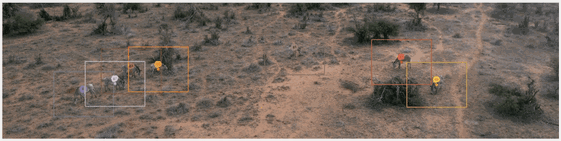
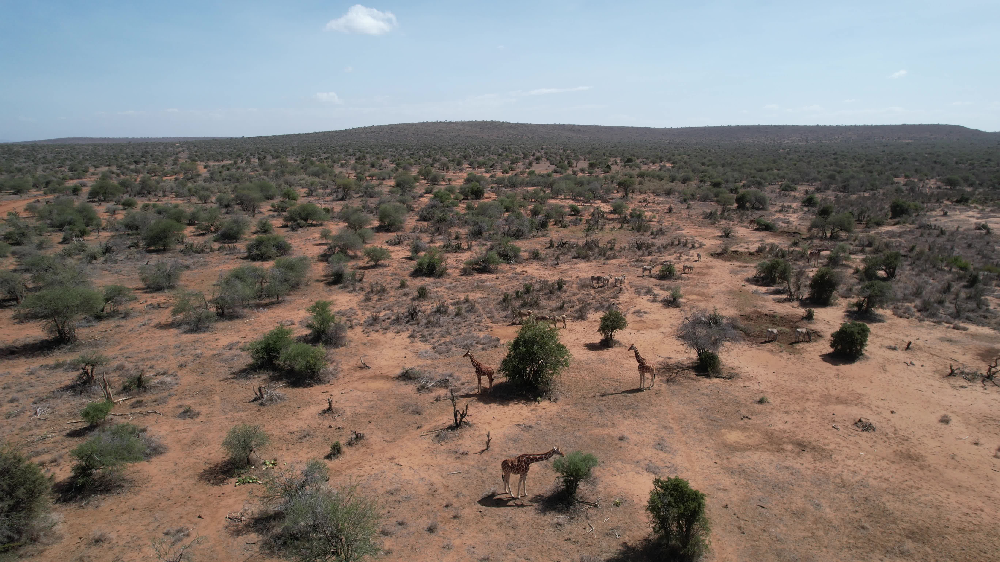
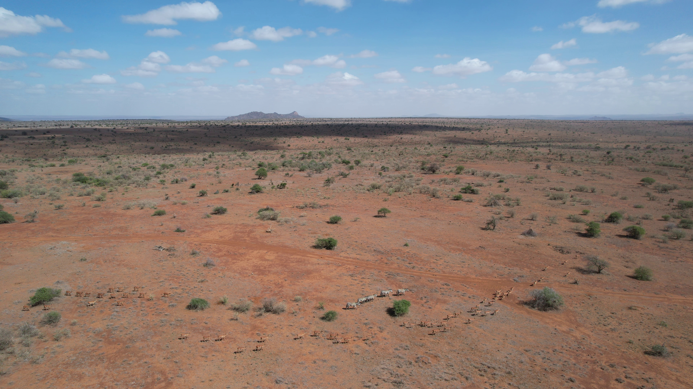
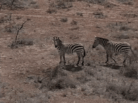
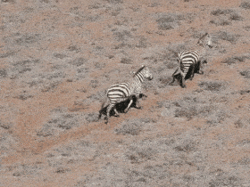
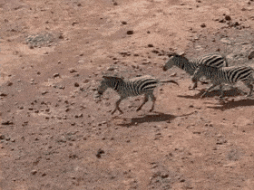

# Drone Maneuver Test-Clip Library

> A replayable, labeled testbed for evaluating self-adaptive wildlife-drone flight policies.

[](LICENSE)
[](https://creativecommons.org/licenses/by/4.0/)
[](https://huggingface.co/datasets/imageomics/drone-maneuver-clips)
[](https://huggingface.co/spaces/imageomics/drone-maneuver-demo)
<!-- [](https://doi.org/xx.xxxx/zenodo.xxxxxxx) — add once the Zenodo DOI is minted -->

<p align="center">
  <br>
  <em>Example clip from KABR with its per-frame ground-truth boxes showing a herd of Grevy's zebras. The labeled input the maneuver harness replays to produce reference drone actions.</em>
</p>

---

## Why this matters

Autonomous drones are transforming wildlife monitoring, but the perception pipelines that
interpret their footage run almost entirely **offline**. Moving computer-vision models into the
drone's control loop — *edge AI* — would enable **self-adaptive flight**: adjusting trajectory in
real time to keep a herd in frame, capture a required viewpoint, or back off when animals show
disturbance. Studying self-adaptive flight requires a **replayable, labeled, multi-session
testbed**, which is what this artifact provides.

We bootstrap the library from [KABR](https://huggingface.co/datasets/imageomics/KABR) (zebras and
giraffes at Mpala Research Centre, Kenya), but the design is deliberately **additive**: clips are
indexed against the **FAIR² Drones** standard, which provides unified platform, autonomy, and
ecological metadata across drone datasets. Because every clip resolves through FAIR² event IDs
rather than dataset-specific paths, new sites and species can be folded into the same benchmark
without restructuring — letting the testbed grow across the community's drone datasets rather than
remaining a single-site snapshot.

> **Cite:** FAIR² Drones (arXiv:2606.00355) · KABR (Kholiavchenko et al.; arXiv:2510.02030).

## What's in this artifact

| Component | What it is | Where |
|---|---|---|
| **Dataset** | 41 six-second aerial clips with per-frame-per-track labels (bbox, species, behaviour, vigilance, track id, GT pose where available, telemetry) + per-frame ground-truth maneuver actions. | [`imageomics/drone-maneuver-clips`](https://huggingface.co/datasets/imageomics/drone-maneuver-clips) |
| **Interactive demo** | A zero-install Gradio app: filter clips, tune the maneuver decision tree live, and score a navigation policy — all CPU-only, in the browser. | [`imageomics/drone-maneuver-demo`](https://huggingface.co/spaces/imageomics/drone-maneuver-demo) |
| **This repository** | The clip-library build pipeline, the deterministic **maneuver replay harness**, and the formal decision-tree specification. | you are here |

## Where the maneuvers apply


<table>
<tr>
<td width="50%" align="center">
  <br>
  <strong>TRACK / SoI-aware</strong><br>
  <em>Mixed (bushy) habitat — the herd centroid drifts behind cover; TRACK recenters it and SoI-aware yaws for a clear viewpoint.</em>
</td>
<td width="50%" align="center">
  <br>
  <strong>SoI-aware / re-ID</strong><br>
  <em>Grevy's zebra — capturing the broadside Surface-of-Interest at a larger apparent size is what makes individual re-ID possible.</em>
</td>
</tr>
<tr>
<td width="50%" align="center">
  <br>
  <strong>APPROACH / TRACK</strong><br>
  <em>Open habitat, large dispersed herd — APPROACH descends to the detected group, then TRACK holds the centroid in the center-50% keep-zone.</em>
</td>
<td width="50%" align="center">
  
  
  <br>
  <strong>BEHAVIOR-ADAPTIVE FLIGHT (BAF)</strong> — head-up, trotting, running<br>
  <em>Head-up, trotting, and running are the vigilance behaviours; when smoothed vigilance rises above threshold, BAF overrides the active maneuver and the drone halts or backs off, depending on user setting.</em>
</td>
</tr>
</table>

> See [`clip_library/maneuver_decision_tree.md`](clip_library/maneuver_decision_tree.md) for the exact
> rule each maneuver follows.

## Quick start

### Option A — Hugging Face Space (recommended, zero-install)

Open the **[live demo](https://huggingface.co/spaces/imageomics/drone-maneuver-demo)**. With no
install you can: browse and filter the clip catalog, play a clip, **tune the decision-tree
thresholds and re-run the harness live**, score baseline (or your own) policies against the
reference, and run the full-benchmark timing + reproducibility hash. This is the fastest way to
understand what the artifact does.

### Option B — Run locally

For programmatic use, batch experiments, or rebuilding the dataset, see
[Installation](#installation) and [Usage](#usage) below. The common path
([Usage → maneuver replay](#running-the-maneuver-replay-framework)) needs only the released
dataset and is **CPU-only**.

---

## System & environment requirements

| | requirement |
|---|---|
| **OS** | Linux (tested: RHEL 9, x86-64) or macOS; Windows via WSL2. Runs natively on all three — no VM/Docker needed. |
| **Python** | 3.9+ (the hosted demo runs 3.12). |
| **CPU / GPU** | **CPU only — no GPU required**, for every workflow in this repo. |
| **RAM** | ~2 GB (video frames are decoded one at a time; the CSVs are small). |
| **Disk** | ~6 GB for the released clip library snapshot. |
| **Download** | ~6 GB one-time `snapshot_download` of the dataset (pinned revision); cached thereafter. |
| **Network** | Needed once to fetch the dataset snapshot; fully offline afterwards. |
| **Setup time** | < 10 minutes including the dataset download (well under the ACSOS 20-minute bar). |

## Installation

```bash
# 1. Clone
git clone https://github.com/Imageomics/wildlife-drone-maneuver.git
cd wildlife-drone-maneuver

# 2. Environment (a virtualenv or conda env is fine)
python -m venv .venv && source .venv/bin/activate
pip install .                  # Mode A harness: pandas + numpy (CPU-only)
# pip install ".[pipeline]"    # Mode B as well: adds opencv-python-headless + pyarrow
# (or `pip install -r requirements.txt` for the dependencies without the package)

# 3. Get the data — pinned to the reviewed release revision.
pip install huggingface_hub
python -c "from huggingface_hub import snapshot_download; \
print(snapshot_download('imageomics/drone-maneuver-clips', repo_type='dataset', revision='v1.1-acsos26'))"
```

The printed path is the dataset root. Point the harness at it with
`export DRONE_CLIPS_ROOT=/path/to/snapshot` (or pass `--out` to the CLI). To **rebuild the clips
from raw KABR video** instead of downloading them, see
[Reproducing the dataset](#mode-b--rebuild-the-dataset-from-raw-kabr-video).

## Usage

### Getting started: load a clip and its labels

```python
import pandas as pd
from huggingface_hub import snapshot_download

root = snapshot_download("imageomics/drone-maneuver-clips",
                         repo_type="dataset", revision="v1.1-acsos26")

catalog = pd.read_csv(f"{root}/catalog/clip_index.csv")
clip_id = catalog.iloc[0]["clip_id"]

labels = pd.read_csv(f"{root}/clips/{clip_id}/labels.csv")     # per-frame-per-track
actions = pd.read_csv(f"{root}/clips/{clip_id}/maneuver_labels.csv")  # GT drone actions
print(clip_id, labels.shape, actions["maneuver"].unique())
print(labels.head())
```

`labels.csv` is one row per frame per tracked individual (bbox, species, behaviour, vigilance,
pose, telemetry). `maneuver_labels.csv` is one row per frame per maneuver — the **ground-truth
drone action** a calibrated controller would take. Full per-column docs are in the
[dataset card](https://huggingface.co/datasets/imageomics/drone-maneuver-clips) and
[`clip_library/schema.py`](clip_library/schema.py).

### Running the maneuver replay framework

The harness replays the formal [maneuver decision tree](clip_library/maneuver_decision_tree.md)
deterministically over a clip's `labels.csv`, emitting the per-frame action set (raw and smoothed),
the triggering branch, and the frame features the decision used.

**Python API:**

```python
from clip_library.maneuver_labels import generate, Params

# Defaults reproduce the released labels bit-for-bit.
out = generate(f"{root}/clips/{clip_id}/labels.csv", maneuver="track", params=Params())

# A "what-if": stricter vigilance threshold for the disturbance-response maneuver.
out = generate(f"{root}/clips/{clip_id}/labels.csv",
               maneuver="behavior_adaptive", params=Params(theta_S=0.3))
print(out[["frame_local", "action_set_raw", "action_set_smoothed", "triggering_branch"]].head())
```

**Command line:**

```bash
export DRONE_CLIPS_ROOT=/path/to/snapshot   # dataset root from Installation (or pass --out)

# Generate GT actions for every clip and the maneuvers it's tagged for.
python -m clip_library.maneuver_labels --all

# Tune a single clip / maneuver (writes a *.custom.csv sidecar; never overwrites the release).
python -m clip_library.maneuver_labels --clip 12_01_23-DJI_0002_000745 \
       --maneuver behavior_adaptive --theta-s 0.3
python -m clip_library.maneuver_labels --maneuver soi_aware --soi right --desired-pixels 100
```

The four maneuvers (`approach`, `track`, `behavior_adaptive`, `soi_aware`) and every branch are
specified, condition-by-condition, in
[`clip_library/maneuver_decision_tree.md`](clip_library/maneuver_decision_tree.md).

> The dataset catalog tags clips with the spec names `launch`/`follow`; the harness and demo use
> the branch names `approach`/`track` (mapping `launch → approach`, `follow → track`). The other
> two names are identical in both.

---

## The tunable parameters (and why they matter)

Every parameter below corresponds to a real field failure mode an autonomous wildlife drone must
trade off. They are exposed through `Params` (Python) and `--flags` (CLI), and live as sliders in
the demo. **With the defaults, the harness reproduces the released labels exactly.**

| Param (`Params` field / CLI) | Controls | Decision branch it gates | Field failure if mis-set | Default |
|---|---|---|---|---|
| `desired_pixels` / `--desired-pixels` | Target apparent animal size (longest bbox side, px) | TRACK & SoI range control (forward/back) | Too small → animal lost / unreliable detection; too large → disturbance | `30` (TRACK) |
| `pixel_band` | Tolerance/hysteresis band around `desired_pixels` | Whether range control acts or holds | Too narrow → jitter/oscillation; too wide → sluggish framing | `0.25` |
| `theta_S` / `--theta-s` | Vigilance threshold on smoothed signal `S_t` | BAF disturbance-response (retreat/hover) override | Too low → drone flees constantly; too high → harasses animals | `0.5` |
| `soi` / `--soi` | Desired Surface-of-Interest (viewpoint/pose) | SoI-aware yaw repositioning | Wrong viewpoint → data scientifically unusable | `left` (broadside) |
| `max_animals` | How many of the largest tracks to follow | Centroid / `mean_px` aggregation | Too low → ignores herd; too high → chases outliers across fission/fusion | `5` |
| `launch_altitude` / `end_altitude` | Climb/descent envelope (m) | APPROACH altitude branches | Mis-set → approaches at a spooking altitude | `50` / `30` |
| `baf_response` | Disturbance action set | BAF trigger action | Backing up can worsen disturbance; tune per species | `retreat` = `{back, up}` |

### `desired_pixels`

The apparent size of the animal in frame, in pixels (longest bounding-box side). It gates the
approach/back-off range control in TRACK and SoI: below `desired_pixels·(1−pixel_band)` the drone
moves `forward`; above `desired_pixels·(1+pixel_band)` it moves `back`. Too small and detection
becomes unreliable and individuals are lost; too large and the drone flies close enough to disturb
the animals. SoI presets per downstream objective (`Params.with_objective`): track `30`, behavior
`100`, re-ID `500` px.

### `theta_S`

The vigilance threshold applied to `S_t`, the trailing 90-frame (3 s) mean of the per-frame
fraction of vigilant animals (behaviour ∈ {Head Up, Running, Trotting}). When `S_t ≥ theta_S` the
Behavior-Adaptive Flight (BAF) maneuver overrides the active maneuver with the disturbance response.
Set it too low and the drone retreats at the slightest movement (no usable data); too high and it
keeps harassing animals that are already alarmed.

### `soi` (Surface of Interest)

The target viewpoint/pose of the herd majority. The eight poses form a **ring**
(front → front-right → right → …); the SoI-aware maneuver yaws the *short way* around the ring to
bring the majority pose to `soi`, then holds at the target apparent size. The right viewpoint is
what makes downstream science (individual re-ID, behaviour scoring) possible — the wrong one renders
otherwise-perfect footage scientifically unusable.

### `pixel_band`

The tolerance (hysteresis) band around `desired_pixels` — the dead-zone in which the drone holds
rather than correcting range. Too narrow and the drone oscillates forward/back on noise; too wide
and it reacts sluggishly to the herd drifting out of the desired size.

### A note on smoothing

`SMOOTH_WINDOW` (3 s = 90 frames @ 30 fps) is a **fixed module constant, not a tunable parameter.**
Raw per-frame action sets are decomposed onto four signed axes (`x, y, z, yaw`), averaged over the
trailing window, then re-thresholded (dead-zone `|mean| ≤ 0.33`) to suppress jitter. It is fixed on
purpose: the smoothed series **defines the published reference label**. Changing it would alter the
benchmark target itself rather than the policy under test, so it is held constant while the
field-meaningful thresholds above stay tunable.

<p align="center">
  <br>
  <em>A mixed herd on the move, two female Plain zebras and a Grevy's zebra with her foal with a herd of impala. Example of a multi-animal scene a navigation policy is scored against, frame by frame.</em>
</p>

---

## Policy scoring (the intended downstream use)

This is what makes the artifact a **benchmark, not a viewer**: a learned navigation policy is scored,
per maneuver, against the harness's ground-truth actions. Scoring is available in the
[demo's "Policy scoring" tab](https://huggingface.co/spaces/imageomics/drone-maneuver-demo); the
semantics below are exactly what it runs.

### Input format

A CSV with one row per frame: `frame_local,action`, where `action` is one of the 9-action space
(`up, down, forward, back, left, right, yaw-left, yaw-right, hover`). Baseline policies produce the
same shape internally, so uploaded and built-in policies are scored through an identical path.

### What it's compared against

The reference is the **`action_set_smoothed`** column of `maneuver_labels.csv` for the chosen
maneuver — i.e. the *published* label, not the raw per-frame set. Scoring against the smoothed series
is deliberate: the smoothed action is the artifact's released ground truth, and it is the stable
target a real controller would track (the raw set is intentionally jittery pre-smoothing).

### How a match is decided

The reference action set is reduced to its **primary action** (`_first_action`: the first token of a
`|`-joined set, e.g. `back|up → back`) and compared for **equality** against the policy's action on
that frame. Per-frame primary-action match keeps the metric interpretable across the 9-action space
and avoids rewarding partial set overlap; policies that emit a single action per frame (the common
case) are scored directly.

### Metrics reported

- **Overall action accuracy** — fraction of jointly-covered frames where the policy action equals
  the reference primary action.
- **Per-action accuracy** — accuracy broken down by the reference action, so a policy that only ever
  predicts `hover` is exposed (high on hover frames, zero elsewhere).
- **Confusion matrix** over the full 9-action space.
- **Frame coverage** — scoring is an inner join on `frame_local`, so only frames present in both the
  policy and the reference are counted (reported as the number of frames scored).

### Baselines

Three reference policies ship and are scored through the **identical** path, so the comparison is
fair:

| Baseline | Behaviour |
|---|---|
| `random` | Uniform random action per frame (seeded). |
| `always-hover` | `hover` every frame — the trivial "do nothing" floor. |
| `greedy-centroid` | Steer toward the herd centroid: `left`/`right`/`forward` from the mean `x_c`. A minimal worked policy. |

### Worked example

In the demo: select a clip in **Clip explorer**, open **Policy scoring**, choose maneuver `track`
and baseline `greedy-centroid`, and click **Score**. You should see an overall accuracy, a
per-action breakdown (the centroid heuristic does well on `left`/`right`/`forward` recenter frames
and poorly on range `back`/`forward` distinctions), and the confusion matrix. Swapping to
`always-hover` collapses accuracy onto the `hover` row — the expected sanity check.

---

## Reproducing the paper's results

The artifact is deterministic and CPU-only; the full benchmark runs in **seconds on one core**.

- **Zero-install:** open the demo's **"Run full benchmark"** accordion. It replays all clips ×
  tagged maneuvers with the default thresholds and prints the **wall-clock time** and an
  **output SHA-256** over the smoothed action labels.
- **Locally:** regenerate every label with the defaults and confirm bit-for-bit equality with the
  release:

  ```bash
  export DRONE_CLIPS_ROOT=/path/to/snapshot   # the snapshot_download path from Installation
  python -m clip_library.maneuver_labels --all
  # Each clips/<id>/maneuver_labels.csv is byte-identical to the released file.
  ```

  The harness asserts this determinism check internally (defaults → released labels); the demo
  surfaces the same check per clip ("✓ Bit-identical to released labels"). Cross-check the locally
  printed hash against the one in the demo's benchmark accordion.

> **Determinism guarantee:** with `Params()` defaults, `generate(...)` reproduces the released
> `maneuver_labels.csv` exactly. Any divergence indicates an environment problem, not a stochastic
> result — there is no randomness in the harness.

## Dataset structure

```
drone-maneuver-clips/                 (Hugging Face dataset, revision v1.1-acsos26)
├── catalog/
│   ├── clip_index.csv     # one row per clip: species_set, habitat, suitable_maneuvers, FAIR² IDs, …
│   ├── video_index.csv    # one row per source video
│   ├── coverage_report.md # species × bbox-size × maneuver coverage
│   └── pose_audit.csv     # per-video GT-pose assignment audit
├── clips/<clip_id>/
│   ├── clip.mp4           # 6 s, 180 frames @ 30 fps, 3840×2160
│   ├── labels.csv         # one row per frame per tracked individual
│   └── maneuver_labels.csv# per-frame GT action set, per maneuver
└── README.md              # the dataset card (full field dictionary)
```

See the **[dataset card](https://huggingface.co/datasets/imageomics/drone-maneuver-clips)** for the
complete per-column field dictionary (it is the source of truth; not duplicated here).

## Repository structure

```
wildlife-drone-maneuver/
├── README.md                       # this file — canonical entry point
├── LICENSE                         # MIT (code)
├── CITATION.cff                    # drives GitHub's "Cite this repository"
├── pyproject.toml                  # installable package (Mode A core; [pipeline] extra)
├── requirements.txt
├── run_pipeline.sh                 # Mode B: rebuild the dataset from raw KABR video
└── clip_library/                   # the installable package (import name: clip_library)
    ├── maneuver_labels.py          # the replay harness — generate / replay / Params / CLI
    ├── maneuver_decision_tree.md   # the formal, citable decision-tree specification
    ├── schema.py                   # geometry, vocabularies, column sets, env-configured paths
    ├── io_paths.py                 # raw-video resolution + CSV/Parquet table I/O
    ├── scan_sessions.py            # Mode B · stage 1
    ├── select_clips.py             # Mode B · stage 2
    ├── extract_clips.py            # Mode B · stage 3
    ├── add_pose_labels.py          # Mode B · stage 4
    ├── make_qa_overlays.py         # Mode B · stage 5
    ├── build_dataset_card.py       # Mode B · stage 6
    └── pose_gt.py / pose_backtrack.py / compare_flights.py   # Mode B helpers
```

The harness (Mode A) imports with only `pandas`/`numpy`; the Mode-B pipeline modules import OpenCV
lazily (installed via the `[pipeline]` extra). The clip media and labels live on **Hugging Face**,
not in this repository; fetch them with `snapshot_download` (see [Installation](#installation)).

## Limitations

- **GT pose is sparse** (only frames carrying KABR pose crops), so the **SoI-aware** maneuver is
  under-exercised on this release and its labels are mostly `hover`; it is fully exercised with dense
  (model-generated) pose.
- **Single site** (Mpala Research Centre) and a **species skew** toward Grevy's zebra. The generic
  `Zebra` label is the coarse KABR label — undifferentiated Plains and/or Grevy's, where the source
  did not split the subspecies.
- **Small apparent sizes throughout** (flown at 20–50 m altitude), so the bbox size classes
  far/medium/close are relative to *this survey*, not absolute scale. KABR was flown lower than ideal
  tracking altitude, so TRACK range-control labels skew toward `back`.
- **Habitat is a structural class** (`open`/`closed`/`mixed`/`unknown`) derived from field metadata;
  the original free text is preserved in `habitat_notes`. Habitats here are open/savanna —
  **not** an assumption suited to heavily vegetated or obstacle-dense settings or
  obstacle-avoidance research.
- **Retrospective, not field-validated closed-loop.** Labels are KABR expert ground truth replayed
  through a policy spec — appropriate for ground-truth *evaluation*, not for characterizing
  perception error or proving in-flight control.
- **Single-drone, single-view.** Multi-view / multi-agent missions are future work.

## Extending to new datasets

The benchmark is **additive by construction**. Every clip references its source only through FAIR²
event IDs (`fair2_video_eventID`, `fair2_session_eventID`) — never dataset-specific absolute paths —
so a new site or species folds into the same schema without restructuring:

1. Resolve the new footage's FAIR² Drones event IDs (platform/autonomy/ecology metadata).
2. Run the build pipeline ([Mode B](#mode-b--rebuild-the-dataset-from-raw-kabr-video)) pointed at the
   new source to emit `labels.csv` per clip in the shared schema (`clip_library/schema.py`).
3. Run the harness (`python -m clip_library.maneuver_labels --all`) to emit `maneuver_labels.csv`.
4. Append the new rows to `catalog/clip_index.csv`; the demo and scoring path consume them unchanged.

Planned expansions (The Wilds, Ol Pejeta) slot in through exactly this path. The decision-tree
parameters are likewise meant to be **re-tuned per species/habitat** rather than treated as universal.

### Mode B — rebuild the dataset from raw KABR video

Only needed to regenerate clips from source (the released dataset already contains everything for
the workflows above). Requires read access to the raw KABR video archive (multi-TB, not
redistributed here) and the pipeline extra (`pip install ".[pipeline]"`). The raw-data locations are
**not hard-coded** — point `clip_library/schema.py` at your copy via environment variables (unset
Mode-B paths default to empty, so the pipeline fails loudly rather than reading a wrong filesystem):

```bash
export KABR_ROOT=/path/to/kabr-full-release       # occurrences + video/session events
export SESSION_DATA_ROOT=/path/to/raw/session_data # raw DJI .MP4/.SRT, by session/date
export POSE_LABELS_DIR=/path/to/KABR-poses         # GT pose crops (stage 4)
export DRONE_CLIPS_ROOT=/path/to/output            # where clips + labels are written
./run_pipeline.sh        # stages 1–6 + the maneuver-label harness (all CPU, single-threaded)
```

| Stage | Module | Output |
|---|---|---|
| 1 | `scan_sessions` | `catalog/video_index.csv` (raw-path resolution incl. duplicate `DJI_xxxx` disambiguation) |
| 2 | `select_clips` | `catalog/clip_index.csv` + `coverage_report.md` |
| 3 | `extract_clips` | `clips/<id>/clip.mp4` + `labels.csv` |
| 4 | `add_pose_labels` | GT pose cross-reference + `catalog/pose_audit.csv` |
| 5 | `make_qa_overlays` | `qa/` overlay videos + contact sheets for manual sign-off |
| 6 | `build_dataset_card` | dataset card |
| + | `maneuver_labels` | `clips/<id>/maneuver_labels.csv` |

---

## License

| Component | License |
|---|---|
| **Code** (this repository) | [MIT](LICENSE) |
| **Dataset** (`imageomics/drone-maneuver-clips`) | CC-BY-4.0 |
| **FAIR² Drones standard** | CC-BY-4.0 |

The dataset is derived from KABR (Kholiavchenko et al.) and KABR-poses; please honor their licenses
and cite them as well.

## Citation

If you use this artifact, please cite **both** this repository and the artifact paper, plus the
source datasets and standard.

**This artifact (software):** see [`CITATION.cff`](CITATION.cff) (drives GitHub's "Cite this
repository" box). Zenodo DOI forthcoming.

**Artifact paper:** *(BibTeX forthcoming — ACSOS 2026 Artifact Track.)*

**Source dataset — KABR:** Kholiavchenko et al., *KABR: In-Situ Dataset for Kenyan Animal Behavior
Recognition from Drone Videos* — [arXiv:2510.02030](https://doi.org/10.48550/arXiv.2510.02030)
([dataset](https://huggingface.co/datasets/imageomics/KABR)). *(Confirm the exact BibTeX/version
against the source before camera-ready.)*

**FAIR² Drones standard:** [arXiv:2606.00355](https://arxiv.org/abs/2606.00355).

## Acknowledgements

This work was supported by the [Imageomics Institute](https://imageomics.org), funded by the US
National Science Foundation's Harnessing the Data Revolution (HDR) program under
[Award #2118240](https://www.nsf.gov/awardsearch/showAward?AWD_ID=2118240) (*Imageomics: A New
Frontier of Biological Information Powered by Knowledge-Guided Machine Learning*). Additional support
was provided by the [AI Institute for Intelligent Cyberinfrastructure with Computational Learning in
the Environment (ICICLE)](https://icicle.osu.edu/), funded by the US National Science Foundation
under [Award #2112606](https://www.nsf.gov/awardsearch/showAward?AWD_ID=2112606). Any opinions,
findings, and conclusions or recommendations expressed in this material are those of the author(s)
and do not necessarily reflect the views of the National Science Foundation.

Built on the [KABR](https://huggingface.co/datasets/imageomics/KABR) dataset and the FAIR² Drones
metadata standard; field data collected at Mpala Research Centre, Kenya.

## Contact

Open an [issue](https://github.com/Imageomics/wildlife-drone-maneuver/issues) for questions or bug
reports. Maintainer: Jenna Kline (`kline.377@osu.edu`).
